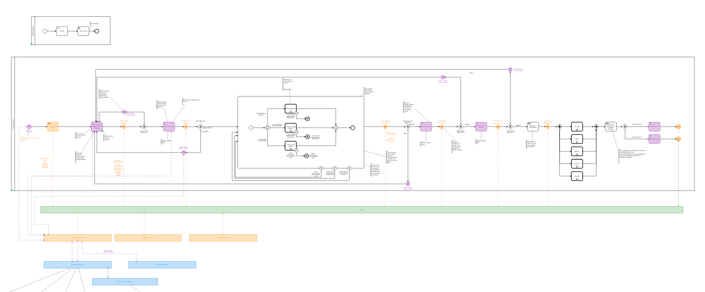
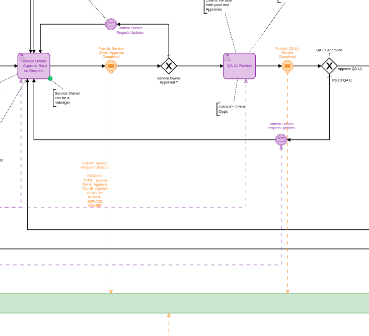
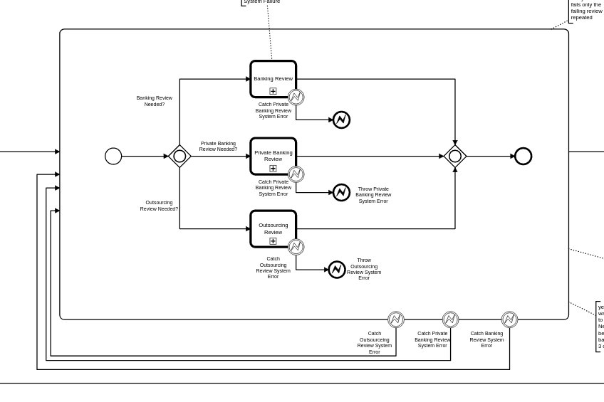
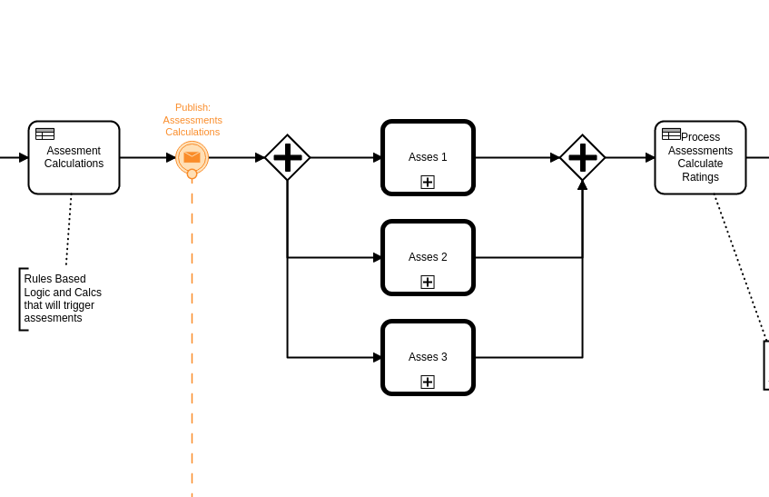
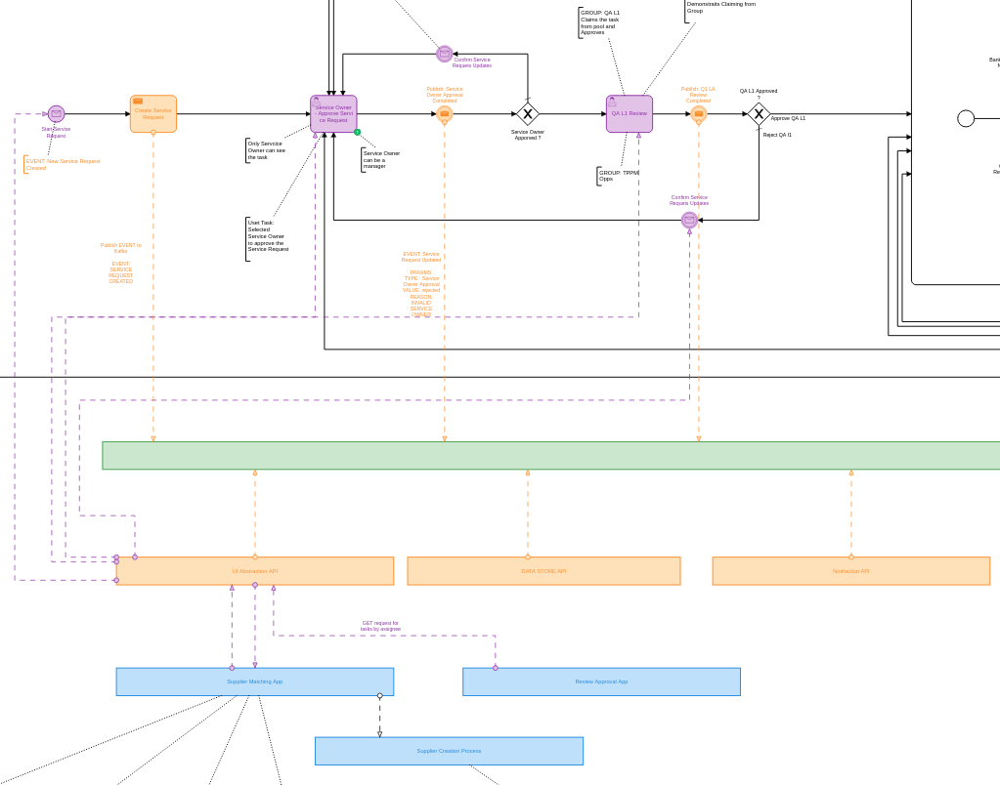

= Business Case: Service Request with Multi-level Approval
Doc Writer <paul.lungu@camunda.com>
v1.0, 2014-08-01
:toc: right

Service Request use-case is focused on demonstrating the service request process through Web Based UI, Notifications and Camunda workflow. The service request process models several human review steps where a approval or rejection can happen. As well as system interactions through async over TCP communications with eventing system (Kafak) and synchronous communications through HTTP/REST in a point to point pattern.


This can server as an example for designing distributed systems with workflow engines as an orchestrator in a choreographed event oriented architecture.


#### Interesting points in the process

====
This section of the process is particularly interesting and packed with functionality. At the workflow level we are orchestrating user tasks for the explicit multilevel review of service requests. After each review we send a Event to Kafaka potentially notifying other systems, like a UI, about the completion of the task and update of the service request.

Notice on the rejection path no User Task is defined for Requester of the service request. This is intentional to signify that the Requestor can be notified in many ways about the rejection and the method of updating the service request is not important to the workflow itself. In technical terms this signifies a loose coupling for these events due to the workflow not orchestrating the interaction rather using a choreography approach. Essentially all the workflow cares about is the rejection is handled in some way but no idea how it happens.
====



====
This section of the process demonstrates the capability to explicitly handle errors and potentially compensate or retry certain activities in the workflow.
====

====
This section of the workflow demonstrates the possibility to use DMN and business rules to accomplish the assessment calculations.
====

## Running the use-case
IMPORTANT: Running the app once with no profile is necessary to initalize the Camunda database.
```
mvn spring-boot:run
```

Then again with the profiles
```
mvn spring-boot:run -Dspring.profiles.active=servicerequest,integration,cors
```

**Profiles** can be specified at the command line when the application starts. The notation is as follows.

`-Dspring.profiles.active=servicerequest,integration,cors`

Or you can use the application.properties file to specify the profile.

```yaml
spring.profiles.active: servicerequest,integration,cors
```

//### Loading Test Data
//TODO: Create REST end-point to parse csv and load service request data, start processes associating with a service id/business key


### Testing with Postman

Use the postman collection `Service-Request-PoC.postman_collection.json` in the `postman` folder.

With post-man you can move through the processes simulating REST requests to the app.
- starting the process with new service request
- completing user tasks
- correlating messages

### See it running
**Visit `http://<server>:<port>/sr` to access the React app.**


## Architecture


====
The diagram above illustrates the interactions and logical components of the app. Note the app is all packed together into one artifact for easier development and PoC ing. But each component could be easily it's own deployable artifact.

The green bar signifies kafka. Events are published to Kafaka from the workflow Send Tasks. The Send tasks are implimented as java delegates. This pattern works well as we can utilize the Delegate and the Send task to control the execution of the workflow and potentially ack Kafaka  and handle incidents when Publishing fails.

The orange boxes signify components that sub-scribe to Kafaka topinc and update other components based on the Events that they receive.

The blue boxes signify components that do specific work and are updated by Events from the subscription components.

Purple lines and events signify point-to-point synchronous HTTP/REST interactions with the workflow and other components.

Orange lines and events signify pub/sub asynchronous interaction with the workflow and other components.

====
NOTE: This is a typical pattern for micro-service architectures though the level of abstraction between components will vary from use-case to use-case.

### Kafka Integration
The spring-boot app is using spring cloud streams.

https://spring.io/projects/spring-cloud-stream

====
The app has a has a single publisher and a single subscriber for the service-request-events topic.

```
spring.cloud.stream.bindings.publishServiceRequest.destination=service-request-events
spring.cloud.stream.bindings.subscribeServiceRequest.destination=service-request-events
```
See the `com.camunda.poc.starter.usecase.servicerequest.kafka.integration` package/folder for impl of publishers and subscribers.
====

====
A single subscriber is implemented `ServiceRequestEventSubscriber.java`; it simply gets the message from the topic and serialized into memory. Then it saves/caches the Service Request into the local db based on the event type.
====

====
Two publishers are implemented, `ServiceRequestCreateEventPublishingDelegate.java` and `ServiceRequestUpdateEventPublishingDelegate.java`. These publishers are also JavaDelegtes and are wired into the bpmn model and are executed during the process execution. This is a powerful pattern as it lets us control the execution of the workflow and handle errors incidents and more.

The publisher publishes a ServiceRequestEvent with event meta-data such as the Name and Type as well as parameters such as workflow state and business data. It also encapsulates a ServiceRequest. which is our primary business object.

The Service Request Event meta-data helps other components understand what to do with the event.
====

### ReactJS UI Integration

The Maven frontend-maven-plugin configured in pom.xml is used to build the ReactJS app. The plugin creates a bundle.js file which ends up in `src/main/resources/static/built/bundle.js`. The static directory makes static resources such as JS and HTML available to the java app.

The Java application boot-straps the ReactJS App through Thymeleaf a java/spring frontend framework. The templates directory `src/main/resources/templates/app.html` has a HTML file app.html which calls the React app through a `<script />` tag loading the HTML into the react div `<div id="react"></div>`

Thymeleaf ties the Java frontend together using a Spring controller. `src/main/java/com/camunda/react/starter/controller/HomeController.java`. Mapping the app context to /home and calling the app.html.

The React Components are organized under the `src\main\js\reactjs` folder into a use-case folder then subdivided by component.

Webpack and package.json define the structure and dependencies for the React App that allow and build the app into the bundle.js which is later placed in the static directory as explained previously. Allowing our frontend to load the plain EcmaScript.

Foundation CSS is used for styling https://get.foundation/sites/docs/index.html

### Handling Business Data and UI Integration
TIP: see the pattern described in the Camunda Best Practices https://camunda.com/best-practices/handling-data-in-processes/ and https://camunda.com/best-practices/enhancing-tasklists-with-business-data/

Often and for numerous reasons we need to consolidate data from different sources. In this app I use JPA and Spring REST with some of springs features to build a custom API. Primarily for making integration with the UI easier. Here are few reasons why I take this approach.

- Reduce queries the UI does to the backend
- Make it easier to build UI components
- Create abstraction layer that can be used to integrate other technical and business requirements like reporting and security.
- Have a source of truth for process meta-data

NOTE: Also keep in mind I want to keep every-thing self contained for PoC purposes. Think in logical terms and that these components could be another technology or several other technologies depending on the specific needs.

#### How does it work
====
Spring REST controllers are used to post data to the workflow. Simple and concise API's are defined for interaction with the process. See `ServiceRequestController.java` The API always takes a SerivceRequest object and returns and HTTP Status. The RESTful endpoint context mapping is associated to events that can happen in the system. Such as CREATE-SERVICE-REQUEST, UPDATE-SERVICE-REQUEST and are intended to work in a point-to-point(request/response) synchronous fashion.

The controllers only POST/PUT data CREATING and UPDATING only.
====
IMPORTANT: The intention is to create a https://martinfowler.com/bliki/CQRS.html#:~:text=CQRS%20stands%20for%20Command%20Query,you%20use%20to%20read%20information[CQRS(Command Query Responsibility Segregation)] pattern for interaction. This can increase scalability while reducing complexity in distributed systems.
====
A separate API and logically separate data-store is used to query ServiceRequest data. Updates to this data-store always happen in an asynchronous fashion. For example when a Approval task in the work flow completes the workflow publishes an UPDATE-SERVICE-REQUEST event. The subscriber reads the event and decides what to do. In certain cases it updates the ServiceRequest in the data-store. Other components can now read from the data-store such as the UI.

We can guarantee the data is published to the data store with the workflow. See the section above on the JavaDelegates that implement the publishing functionality.

https://spring.io/blog/2011/02/10/getting-started-with-spring-data-jpa[Spring Data JPA] is the technology used for the ServiceRequest data. Spring Data allows for an easy way to create API's that are easy for a UI to query. Also an easy way to combine data into a useful form for the UI to consume.
====

## Developing with this PoC Starter Project
#### Setting up React for Dev
- run node and server.js by starting a node server in the home directory of the project. You may need to run `npm install` first.
```
nodemon server.js
```
also run the web-pack watch in the project home so you can update the bundle as you build reactjs
```
webpack -w
```

#### Running the server for Dev
NOTE: you need to run the cors profile when using nodemon

- Also note you can use spring-dev-tools to build front and back-end component in dev mode providing faster restarts and live-reload.

for dev mode run the following with the appropriate profiles
```
mvn spring-boot:run mvn spring-boot:run -Dspring.profiles.active=servicerequest,integration,cors
```

WARNING: spring-dev-tools affects the way Camunda serializes objects into process vars and will cause serialization errors in some cases. So it is commented out in pom.xml by default.

#### Running Kafka
NOTE: A simple Kafka congfig is packaged into docker-compose. See `docker-compose` directory in the project home folder. Also you can run docker compose as follows.
```
 docker-compose up
```

Use the downloaded Kafka Distro if you prefer. I have included the distro in the `kafaka` folder in the project home. See Kafaka docs to run it. https://hub.docker.com/r/bitnami/kafka/

NOTE: I use the consumer in the kafak distro during dev to see when messages are published.
```
./bin/kafka-console-consumer.sh --topic service-request-events --bootstrap-server localhost:9092
```
