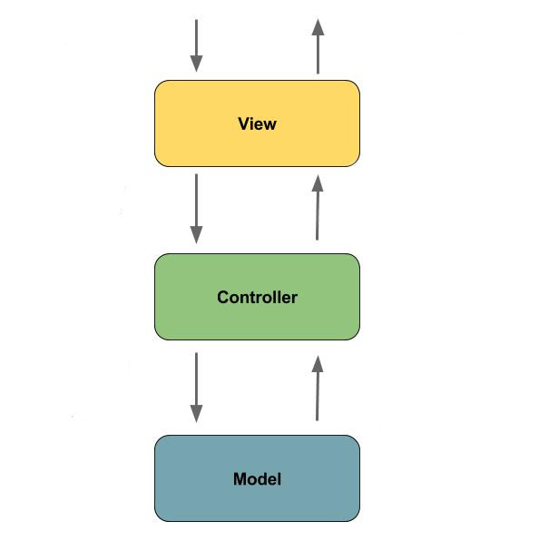

# Camunda React Starter App
The purpose of this application is to have a custom UI application that can exemplify some complexity interacting with Camunda for consulting to use as a starter project.


## Summary

The Camunda React Starter App is a Java app that utilizes the Camunda JAVA API's to interact with Camunda. A React app is also built and deployed using maven plugin. The React app utilizes custom Controllers to interact with the work-flow.

## TODO

- Use the Camunda REST api's from the React app

- **Add middle-ware layer to aggregate calls to the REST API e.g. GraphQL **

  - Implementation is to just add new spring controllers that call the camunda rest API's

- Add keycloak and route API calls through security 

- Improve the front-end plugin so node/npm don't need to be installed globally 

  - **DONE: needs testing**

- Automate seeding of app on startup through CSV

- Setup docker-compose

- **Create architecture diagrams to exemplify complex UI architecture**

- Externalize email template

- **Improve the style of the UI**

- Add Batch complete example with data-tables (example [here](https://gitlab.com/camunda-poc-roche.com/roche) ) 


## Architecture




## Use Case

Lease Renewal App allows apartment leasing agents to manage apartment lease renewal process through email. A leasing company may manage hundreds of apartments which will come up for renewal at different times during the year. The renewal process will need to start well before the apartment is up for lease to make sure there is time to list the apartment if the current tenant does not want to renew. A deadline must be set to ensure the apartment will be rented out as soon as possible if the tenant does not want to renew the lease. The tenant must be given multiple chances to renew up to the deadline. It's necessary to track the email sent to the tenant and responses from the tenant so it's easy and efficient for the property manager to track a renewal. 


## ReactJS UI Integration 

The Maven frontend-maven-plugin configured in pom.xml is used to build the ReactJS app. The plugin creates a bundle.js file which ends up in ```src/main/resources/static/built/bundle.js```. The static directory makes static resources such as JS and HTML available to the java app. 

The Java application boot-straps the ReactJS App through Thymeleaf a java/spring frontend framework. The templates directory ```src/main/resources/templates/app.html``` has a HTML file app.html which calls the React app through a ```<script />``` tag loading the HTML into the react div ```  <div id="react"></div> ```

Thymeleaf ties the Java frontend together using a Spring controller. ```src/main/java/com/camunda/react/starter/controller/HomeController.java```. Mapping the app context to /home and calling the app.html.

**Visit ```http://<server>:<port>/home``` to access the React app.**


## Setting up the App

### Environments
The application can have many different configurations depending on where it is deployed and what the goal of the deployment may be. Generally we will take advantage of 2 different environments with three different configurations

- Development (dev)
- Production (prod)


### Configuration
The application utilizes Spring profiles to manage configurations and environments. See more here https://docs.spring.io/spring-boot/docs/current/reference/html/boot-features-external-config.html

The configurations are related to the environments specified above. Additionally there is a default configuration that is not specific to an environment. The application uses properties to specify a configuration. These configurations are grouped into files with the following naming pattern.
```` application-{evironment}.properties ````
or just ````application.properties```` for the default configuration.

Additionally properties can specified at the command line when the application starts. The notation is as follows.
```` -Dspring.profiles.active=init-roles,cli ````
Properties specified at the command line overrirde properties in the .properties files.

The ***Config*** class makes the configs codeable *more to come ...* 

### Security

Roles and users can be added to the app on initialization. In other words the first time the app starts we can initialize the app with some users and groups. This allows users to login to the app. This is done in the .properties files.

### Scheduling Background Processes

The app makes heavy use of Quartz Scheduler to start the lease renewal process and set the grace periods, also to clean up completed lease renewals. See the following for more on Quartz. Look at the .properties files for more details on setting up the scheduling.
- http://www.quartz-scheduler.org/documentation/quartz-2.x/tutorials/crontrigger.html

### Externalizing Configuration
All the properties in the .properties files can be externalized plus many more that are not specific to our app but the app utilizes. More options for properties can be located in the spring documentation for the specific module

Look at the .properties files for examples.

### Profiles
Spring profiles are configured to allow the execution of different components of the app depending on the environment and need. For example you may want to use the **seed** profile in dev to seed the DB with data or **cli** to run the command line runner. Take a look and LeaseRenewal class for specifics on profiles related to the app. Also be sure to read through the Spring docs on profiles. 

**Profiles Configs**

- init-roles - used to initialize the app with groups and users
- seed - used to seed the app with data
- cli - used to run the command line runner
- schedule-renewal-start - used to schedule the startup of lease renewals
- schedule-renewal-clean - used to clean completed lease renewals

These profiles are not coded in the Lease Renewal app. Instead they are initiated by the .properties file naming convention.
```` applicaiton-dev.properties ````

- dev
- prod
- test


### Running the App 

The application is packaged as a jar for easy deployment. The app can be started with a combination of parameters depending on the environment. 
Example of starting in dev environment with the profiles init-roles,seed,cli,dev also externalizing the Sendgrid api key.

````bash
mvn clean install -DskipTests
java -Dspring.profiles.active=init-roles,seed,cli,dev -jar target/camunda-react-starter-app.jar 
````

or

````bash
mvn spring-boot:run -Dspring.profiles.active=init-roles,seed,cli,dev 
````


**Testing the app**

To start the renewal process run the following 

``` http://<server>:<port>/import/all ```

``` http://<server>:<port>/renew/start ```


## Deploying the app

### Docker and Docker-Compose

**TODO: setup docker-compose**


### Heroku

Deploying to heroku requires the use of GIT and the Heroku CLI. See following for more on deploying spring applications.
- https://devcenter.heroku.com/articles/deploying-spring-boot-apps-to-heroku
- https://devcenter.heroku.com/articles/procfile
- https://devcenter.heroku.com/articles/connecting-to-relational-databases-on-heroku-with-java#using-the-jdbc_database_url


Sometimes it's necessary to reset the DB. See following.
- https://devcenter.heroku.com/articles/heroku-postgresql#pg-reset


#### Environemnt configs

There are a few configurations you must add to heroku for the app to work corectly
- JDBC_DATABASE_URL - This config is added for you. You wont see it in the Heroku dashboard. Run the following command to confirm this is set.
````
heroku run echo \$JDBC_DATABASE_URL
````
- MAIL_SERVER_PASSWORD - This is the password for the mail server the app is using
- ENVIRONMENT - Sets the environment configureation the app will use based off the application-<env>.properties file
  -- In production this app will be set to `prod`. In test it well be `test`, dev is `dev`.
- PROFILE - This varible is used to configure the active profiles running on the app. See profiles above for details on what each profile does. Keep in mind this is based on the Procfile and will only take affect in an environemnt that uses the procfile like Heroku.
  -- schedule-renewal-start,schedule-renewal-clean will be the typical config for this variable
  -- for first startup and testing the environments there may be a different comnination e.g. init-roles,seed


## Email Messages

**You will see several tasks that look like the following. These tasks configure the message that will be sent in the process using Freemarker templates.**

```xml
 <sendTask id="sendTenantMessage" name="Send Tenant Message" camunda:asyncBefore="true" camunda:class="com.camunda.react.starter.bpm.SendMail">
      <documentation>Sends the message input by the property manager in the Confirm Renewal State task.</documentation>
      <extensionElements>
        <camunda:inputOutput>
          <camunda:inputParameter name="cc" />
          <camunda:inputParameter name="to">${recipients}</camunda:inputParameter>
          <camunda:inputParameter name="bcc">${systemEmail}</camunda:inputParameter>
          <camunda:inputParameter name="subject">
            <camunda:script scriptFormat="freemarker">You still have time to renew your lease ${property}!</camunda:script>
          </camunda:inputParameter>
          <camunda:inputParameter name="html">
            <camunda:script scriptFormat="freemarker">&lt;html&gt;
	            &lt;body&gt;
	              Hello Tennat,&lt;br/&gt;&lt;br/&gt;
	
	              ${message} &lt;br/&gt;&lt;br/&gt;
	              
	              Kind regards,&lt;br/&gt;
	              TheCompany.
	            &lt;/body&gt;
	          &lt;/html&gt;</camunda:script>
          </camunda:inputParameter>
          <camunda:inputParameter name="text">
            <camunda:script scriptFormat="freemarker">Hello Tennat,

${message} 
	             
Kind regards,
TheCompany.</camunda:script>
          </camunda:inputParameter>
          <camunda:inputParameter name="from">${systemEmail}</camunda:inputParameter>
          <camunda:outputParameter name="mailSendResult">${ resultStatus }</camunda:outputParameter>
        </camunda:inputOutput>
      </extensionElements>
      <incoming>renewalStateDecisionToSendTenantMessage</incoming>
      <outgoing>sendTenantMessageToAwaitTenantReply</outgoing>
    </sendTask>
```

### Importing CSV Files
Files can imported from the imports page. Three csv files exsit in the base directory with test data.

#### TODO: Document importing 


