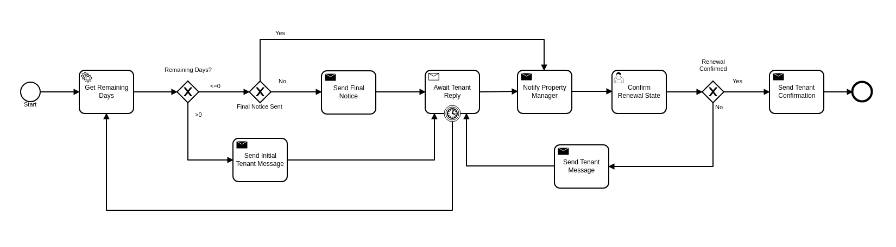

# Camunda PoC Starter
The purpose of this application is to have a starter for PoC and other less structured engagements. This enables the consultant to easily discuss and demonstrate common concepts and patterns without customizing the application. Additionally it can be used as a starter project in many cases. 


## Summary

The Camunda React Starter App is a Java app that utilizes the Camunda JAVA API's to interact with Camunda. A React app is also built and deployed using maven plugin. The React app utilizes custom Controllers to interact with the work-flow.


###Get started in a PoC or other engagement

1. Fork the project on github
2. It's a simple spring-boot project at it's core. Simply run the app and you will have a working instance of Camunda.
3. Bells and whistles can be added to the project by adding a profile when starting the project.  See **Profiles** sections for more.


###How to contribute

To contribute please fork the project and then make your changes in a branch and create a pull request. The maintainer will merge your changes into the project. Please be sure to remove any customer information from the code or artifacts.


### Project Structure

The project has an opinionated project structure.

**Conventions for reusable or general usecase JAVA code**  

such as auth or securtity or email etc... belong in the appropriate package under the ***starter*** package. 

For example for keycloak authentication

``` java
src/main/java/com.camunda.poc.starter.auth.keycloak
```

**Conventions for JAVA code specific to a use case** 

there is ***usecase*** package. Create a new package under this package.

``` src/main/java/com.camunda.poc.starter.usecase.your-use-case```

See the project for examples

**Conventions for non-code artifacts**

BPMN files live in ```src/main/resources/processes``` and use a prefix for general and specific use-case

 ```usecase-usecase-example.bpmn```.

Example general use -case ```event-integration-example.bpmn```

Example specific use-case ```renewal-process-example.bpmn```

**Conventions for JS code** 

JS code for custom ReactJS UI lives in 

``src/main/js/reactjs/<use-case>/components``


## Use Case: Renewals

Renewal Renewal use-case allows apartment leasing agents to manage apartment lease renewal process through email. A leasing company may manage hundreds of apartments which will come up for renewal at different times during the year. The renewal process will need to start well before the apartment is up for lease to make sure there is time to list the apartment if the current tenant does not want to renew. A deadline must be set to ensure the apartment will be rented out as soon as possible if the tenant does not want to renew the lease. The tenant must be given multiple chances to renew up to the deadline. It's necessary to track the email sent to the tenant and responses from the tenant so it's easy and efficient for the property manager to track a renewal. 



### Architecture

***more to come ...***


####Renewals: ReactJS UI Integration

The Maven frontend-maven-plugin configured in pom.xml is used to build the ReactJS app. The plugin creates a bundle.js file which ends up in ```src/main/resources/static/built/bundle.js```. The static directory makes static resources such as JS and HTML available to the java app. 

The Java application boot-straps the ReactJS App through Thymeleaf a java/spring frontend framework. The templates directory ```src/main/resources/templates/app.html``` has a HTML file app.html which calls the React app through a ```<script />``` tag loading the HTML into the react div ```  <div id="react"></div> ```

Thymeleaf ties the Java frontend together using a Spring controller. ```src/main/java/com/camunda/react/starter/controller/HomeController.java```. Mapping the app context to /home and calling the app.html.

**Visit ```http://<server>:<port>/home``` to access the React app.**


## Use Case: Registrations 

The registrations use case is an example of handling a customer registration / onboarding process. This process demonstrates bulk completion of human tasks with a traditional server side JSP style UI. Additionally it leverages JS data-tables to create a slick list page for displaying UI.

***more to come ...***

### Architecture

***more to come ...***


## 

##Use Case: Email Notifications

***more to come ...***

### Architecture

***more to come ...***


## 

##Use Case: Integrations with events and messaging

***more to come ...***

### Architecture

***more to come ...***


## 

##Use Case: Authentication with Keycloak

***more to come ...***

### Architecture

***more to come ...***


## 

## Use Case: Scheduling Processes

***more to come ...***

### Architecture

***more to come ...***


## Use Case: Batch Process

***more to come ...***

####Architecture

***more to come ...***


## Setting up the App for your use-case

### Profiles
The application can have many different configurations depending on where it is deployed and what the goal of the deployment may be. Profiles can be set standalone or in conjunction with other profiles to create the configuration needed for the app. Each profile will enable specific functionality. Profiles are set and enabled by postfix on a .properties file and/or a @Profile annotation on the specific code.

The application utilizes Spring profiles to manage configurations and environments. See more here https://docs.spring.io/spring-boot/docs/current/reference/html/boot-features-external-config.html

The configurations are related to the profiles specified in the Profile Examples section. Additionally there is a default configuration that is not specific to an environment. The application uses properties to specify a configuration. 

These configurations are grouped into files with the following naming pattern.
```` application-{profile}.properties ````
or just ````application.properties```` for the default configuration.

Profiles can be specified at the command line when the application starts. The notation is as follows.
``` -Dspring.profiles.active=dev,renewals ```

Or you can use the application.properties file to specify the profile.

```spring.profiles.active: dev,renewals```

**Note:** Properties specified at the command line override properties in the .properties files.

**Note:** the global configurations are in the application.yml file in the resources directory.

**Profile Examples**

- Development ```application-dev.properties```      ```-Dspring.profiles.active=dev ```


- Authentication and Authorization ```applicaiton-auth.yaml``` 
- Email    ```application-email.properites```    
- Integration    ```application-integration.properties```
- Security     ```applicaiton-secutrity.properits```
- Renewals Use Case   ```application-renewals.properties```
- Production     ```application-prod.properties```


####Custom Application Configuration through code

The ****AppConfigProperties.java**** class makes the configs code-able  

Adding configs to this class allows you to customize the configurations. This class will pickup properties from a .properties/yaml and allow you to inject this class into other classes as needed.

***more to come ...***

### 

### Externalizing Configuration
All the properties in the .properties files can be externalized. 

Look at the ***application-prod.properties*** files for examples of utilizing environment variables with the app. This is particularly useful if your running in serverless environment and you cannot store property values in your code repo.


### Running the App 

The application can be packaged as a jar for easy deployment to serverless environment. 
Example of starting with profiles also externalizing the Sendgrid api key.

````bash
mvn clean install -DskipTests
java -Dspring.profiles.active=prod,renewals,email -DSENDGRID_API_KEY=<someapikey> -jar target/camunda-poc-starter.jar 
````

or for development run 

````bash
mvn spring-boot:run -Dspring.profiles.active=dev,<other profile> 
````

**Profiles** can be specified at the command line when the application starts. The notation is as follows.
``` -Dspring.profiles.active=dev,renewals ```

Or you can use the application.properties file to specify the profile.

```yaml
spring.profiles.active: dev,renewals
```


**Loading Data**

To load some default data 

``` http://<server>:<port>/batch/start ```

``` http://<server>:<port>/renewals/start ```


## Deploying the app

### Docker and Docker-Compose

Services are configure in the docker-compose.yaml to run the app in docker with a default network.

1. Uncomment the appropriate services for your application and profiles in the docker-compose.yaml located in the docker-compose directory.
2. Make sure to build the spring-boot app
3. run docker-compose up from the docker-compose directory

### Heroku

Deploying to heroku requires the use of GIT and the Heroku CLI. See following for more on deploying spring applications.
- https://devcenter.heroku.com/articles/deploying-spring-boot-apps-to-heroku
- https://devcenter.heroku.com/articles/procfile
- https://devcenter.heroku.com/articles/connecting-to-relational-databases-on-heroku-with-java#using-the-jdbc_database_url


Sometimes it's necessary to reset the DB. See following.
- https://devcenter.heroku.com/articles/heroku-postgresql#pg-reset


####Environment configs

There are a few configurations you must add to Heroku for the app to work correctly
- JDBC_DATABASE_URL - This config is added for you. You wont see it in the Heroku dashboard. Run the following command to confirm this is set.
````
heroku run echo \$JDBC_DATABASE_URL
````
- Externalize environment specific configurations that should not be stored in .properties files. E.g. mail server password

- Use environment configurations the app will use based off the profiles 
  application-<profile>.properties 

- Procfile - This file is used to configure the HEROKU service to run the app. Spring profiles can be used along with the Procfile to configure the app. 
  See profiles above for details on what each profile does. 
  Keep in mind this is based on the Procfile and will only take affect in an environment that uses the procfile like Heroku.

  **Procfile example** 

  ```
  web: java -Dserver.port=$PORT -Dspring.profiles.active=$PROFILE,$ENVIRONMENT -jar target/camunda-poc-starter-app.jar
  ```


  In the heroku configuration panel we can feed in the parameters to our startup command and the app configs in the .properties files.

  ​

## TODO

- Use the Camunda REST api's from the React app
- **Add middle-ware layer to aggregate calls to the REST API e.g. GraphQL **
  - Implementation is to just add new spring controllers that call the camunda rest API's
- Add keycloak and route API calls through security 
- **Create architecture diagrams to exemplify architecture usecases based on biz usecases**
- Externalize email template
- **Improve the style of the UI**