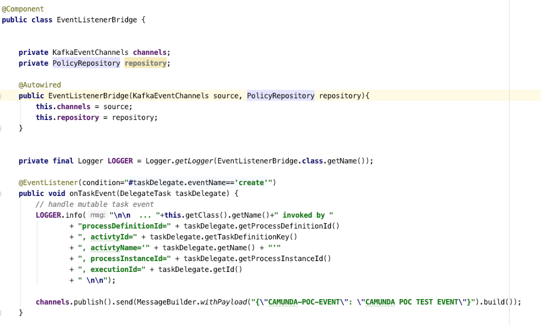

### Camunda-Spring Event Listener Bridge

The Spring Event Bridge allows for hooking into spring event bus and allows the developer to write a custom handler to capture execution, task and history events.

See https://camunda.com/best-practices/reporting-about-processes/[Reporting about Process best practices] for a better understanding of approaches to custom reporting with Camunda.

See https://docs.camunda.org/manual/latest/user-guide/spring-boot-integration/the-spring-event-bridge/[Docs on spring event bridge] for more info on the technology.

==== Custom Example
====
Got to `com.camund.poc.starter.bpm.EventListenerBridge.java`

The interesting points about this class

- It's a standard spring Component
- Kafka Event Channels are injected
- A custom repository is injected
- Event Listeners can be configured with Spring EventListener annotations
====

