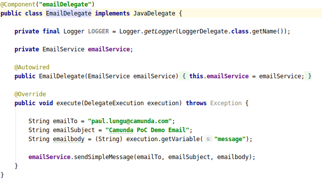
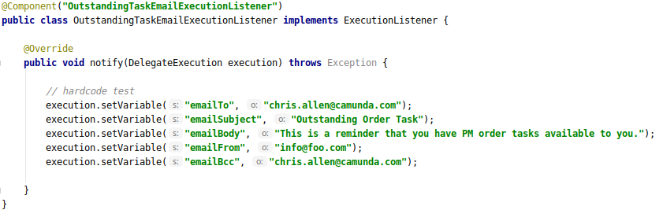
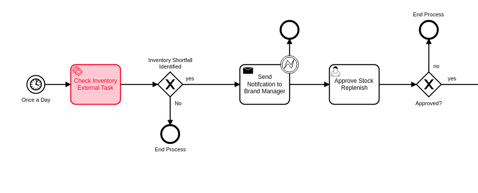
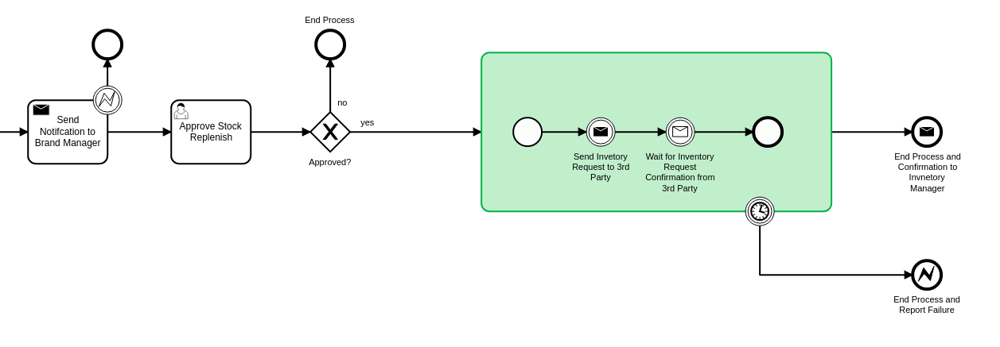

## [[patterns-for-integration]]Patterns for Integration
---
It's important to consider how to implement integrations with a workflow. Two basic patterns exist, integrate within the workflow execution or outside the workflow execution. The sections below provide details about the two patterns.

### [[workflow-execution]]Access to the workflow execution context
====
The workflows in this project utilize the workflow execution to perform actions and interact with other systems and control the flow of custom code execution through the use of Java Delegate and Execution Listeners.

*Java Delegates* as shown below are marker interfaces that allow the executing class to be passed the execution context know as the DelegateExecution object. This object contains many functions that allow the Delegate to interact with the engine and data in the process. This is also a natural extension point that can be used to integrate with other systems. An example would be calling an email service to send email based on workflow variables.

*Execution Listeners* function in much the same way as a JavaDelegate and the interfaces can be used interchangeably. Conceptually the execution listener is intended to be placed in the process in a more subtle way. *Execution Listeners* are placed in the execution on events that are part of the workflow execution. See the docs to understand more about https://docs.camunda.org/manual/latest/user-guide/process-engine/delegation-code/#java-delegate[Delegation Code]

https://docs.camunda.org/manual/7.12/user-guide/process-engine/transactions-in-processes/#understand-asynchronous-continuations[Read more about placing listeners here]. Also, in the https://docs.camunda.org/manual/7.12/user-guide/process-engine/transactions-in-processes/[same doc] read about wait states and transaction bounderies to provide more contect on the operation of the engine.

====

### External Task Pattern for Polyglot Programming

====
The red activity above illustrate the external task pattern configuration. The single task is configured as a topic. The control is inverted and a calling worker will application will ask for work from the engine through the external task API. The external task API is quite powerful allowing the caller to request work in bulk and complete tasks in bulk. Also it allows for creating incidents and errors in the engine.

Additionally, the worker application can be written in any technology as it is independet of the Camunda engine.

See the https://docs.camunda.org/manual/develop/user-guide/ext-client/[external task docs] for more about the API.

See the https://camunda.com/best-practices/invoking-services-from-the-process/#_understanding_and_using_strong_external_tasks_strong[Best Practices] for insights on external tasks.

====

### Send and Recieve

====
The *Send and Receive* or bup/sub pattern is used in cases where simplicity in interaction with API's is preferred to the power and complexity of the external task api. It also provides some flexibility in the modeling approach as the send activity and receive activity do not need to be in sequence. Other activities can be used in parallel with the send and receive activities.

It's often required to use a small amount of Java code, <<workflow-execution,see Java Delegate section>>, with the *Send* task which provides flexibility in implementation and allows integration with other messaging systems. The publishing Send task code should likely be dumb and only do very specific publishing function.

The *Receive* task can be correlated through the REST API and any technology can be used to implement the subscribing application. The subscriber would likely live outside the engine application context.
====
