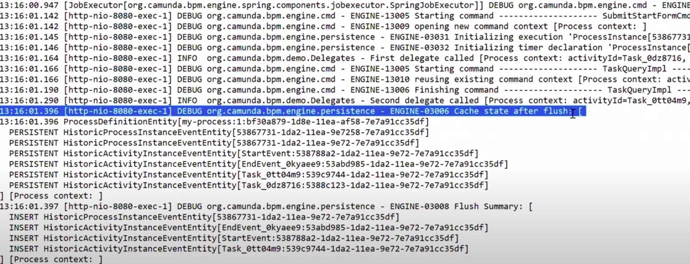
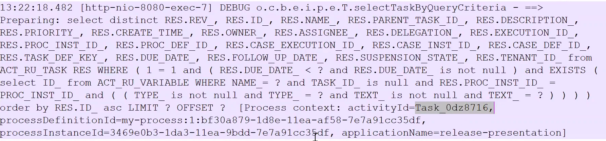

= Use Case: Practicle Performance Tuning
Doc Writer <paul.lungu@camunda.com>
v0.3, 2020-05-07
:toc:

== *Use Scientific Approach*

IMPORTANT: Use a scientific approach to performance tuning. This means before going and changing things have solid understanding why you are changing stuff.

1. Gather information
2. Analyse information
3. Create a hypothisis
4. Measure

== *Steps to consider when approaching performance*

=== 1. Detecting a problem (This usually falls on the customer)

Customers will likely approach you with the following.

- UI is slow. Maybe the tasks are appearing very slowly. Cockpit is tacking a long time to show instances.
- Performance tests are slow. Usually this is some kind of end-to-end test and average results are measured.
- Slow performance is detected by high level system monitoring tools. e.g. Slow queries are detected by DB monitoring.

IMPORTANT: Be sure to understand the goals of the customers. Ask for the perfromanc KPI's.

==== Things to request from customer
====
- How many processes do you want to start?
- How does your load test work?
- How long should a process take?
- How do you measure latency of process?
- Do you have visibility into the hardware performance?
- Top 10 slow queries?
- Has CPU profiling shown slowness in any specific functions?
- Does a thread dump show any blocked threads?
====

==== Things to Advise
====
- Don't change to many variables at once, usually best to change only one
- Use the steps, analyse and measure
- Better Load Testing (See below)
- Isolate the problem (See below)
- Use tools to create visiblilty
====

=== 2. Analyse root cause, understand the problem (Usually the job of consulting and support)
====
IMPORTANT: Establish an approch to the problem based on measurement. The measurement of process execution performance can be divided into two main phases. *__Throughput__* How many process and/or transactions can be started. *__Latency__* How long does a business transaction take (defined by wait states in the process or lack there of).
====
link[See below for more]

=== 3. Apply changes (Consultant Can Suggest)
==== How To Apply changes
====
Always apply changes in a methodical and structure way.

- Using a spreadsheet is a good approach to track changes.
- Do not change more than 1 variable at a time before measuring the effect of the change.
- Make sure to go through root cause analysis so you understand and have formed a theory why you are making the change.
- Build tests that isolate throughput and latency issues and that can be run quickly
====

==== What could be changed
====
Depending on what we find from analysis

- SQL Queries could be rewritten
- Indexes added or removed from DB
- Change the API usage
- Change third party code
- Change environment and engine configurations
** Application HTTP Thread Pools
** Job Executor
** Database Connection Pool
** Change or increase database resources
- Redesign processes
====

=== 4. Repeat
Do it over again. Often an assumption may be wrong but can reveal some useful information. Follow the steps by analysigng the information, forming a hypothesis, then testing by making changes in a structured and measurable way.

== Building Better Load Tests

==== Building tests for Throughput
====
A throughput test should have a specific targeted aim.

- Such as starting n number of workflows.
- Or testing the number of Jobs that can be started
====

==== Building tests for Latency
====
A latency test should have a specific and targeted aim.

- How long does it take to get n number of user tasks?
- Or how long does it take to execute n number of tasks?
- How long does it take to execute n number of workflows.
====

== *Digging In - Analyse Root Cause*

=== Tools for Detecting, Measuring and Analysing
====
- Logging - Have a good logging pattern set up that can provide useful information.

    Example <pattern>%d{HH:mm:ss.SSS} [%thread] %-5level %logger{36} - %msg%n</pattern>

- Thread Dumps - See if threads are stuck, blocked, waiting for long time
- Profiling - Profile CPU to see where time is spent
- System monitoring tools - JvisualVM, YourKIT, JStack, SSH Tunnel
- Slow query log
- Query plans
====

=== Using loggers to detect, isolate, and determine root cause

Loggers will likely be the first line in detecting, isolating and generally gathering information about performance issues. Loggers can help identify latency and throughput issues depending on how they are applied.

TIP: The idea is to use the loggers to identify slow operations. The timestamps can be used to see how long a particular Command or Query, Job, etc ... took to execute.

TODO: Video on using loggers

=== Throughput Issues
====
When dealing with throughput issues there are generally a couple places to look.

1. The number of Workflows that can be started.
2. And the number of Jobs that can be started.

Both 1, 2 boil down to the resources available to the application. Since each Workflow execution requires at least one (Java) Thread.

The execution of a Worklflow by an external client generally happens through the REST API or the JAVA API. This means a Thread from the caller/client will be used to execute the Workflow until the Workflow reaches a stopping point i.e. wait state, such as a user task or message wait or the Workflow ends.

The execution of jobs is a bit more complicated but conceptually from the workflow execution perspective a job normally ends up executing a workflow using a Thread managed by the Engine, until the Workflow reaches a stopping point i.e. wait state, such as a user task or message wait or the Workflow ends. The main difference is Job execution is managed internally by the Engine and Jobs are stored in the Database. So jobs must be queried before they are executed. Introducing potential database latency issues.

Factors affecting throughput

- Single operation performance
- Limits of resources
====

=== Throughput - Debugging jobs
====

When enabling the Job logging to measure throughput the goal is to a achieve a baseline measurement. In this case we probably don't want to use a real world use-case for our BPMN model. But rather a model that will isolate the job execution and allow fast testing iterations. Also we should set some KPI's that will allow us to measure our overall system performance for average loads and peak loads.

Once we establish base lines then we can tweak the environment to achieve the performance goals.

Finally we can include real-world business process logic and start to measure the effects on throughput and start to detect and analyse latency issues.
====

=== Throughput - Starting processes and tasks
====

When measuring throughput for starting processes the goal is to a achieve a baseline measurement. In this case we probably don't want to use a real world use-case for our BPMN model. But rather a model that will isolate the start of the workflow and allow fast testing iterations. Also we should set some KPI's that will allow us to measure our overall system performance for average loads and peak loads.

Measuring starting of process is very specific to the environment and testing tools. It's ideal to use load testing tools you know.

*Building models that isolate starts, e.g. only have start and end events, and potentially eliminate database activity can be a good approch to understand how much throughput the system can handle.*

Once we establish base lines then we can tweak the environment to achieve the performance goals.

Finally we can include real-world business process logic and start to measure the effects on throughput and start to detect and analyse latency issues.
====

=== Latency Issues
====

Latency can generally be thought of as `how long is it taking to execute a certain number of steps in a Workflow, generally demarcated by transaction boundaries` or `the entire workflow`

This leads to the question `what's happening while a Workflow is executing?` and `what's in this workflow?`

To understand latency issues we can use different approaches to understand why potentially unacceptable latency exists in the process. Below is an approach with loggers that can help identify latency in workflow.

It's important to clarify what is acceptable latency.
====

==== Loggers for visiblity into job execution
    <logger name="org.camunda.bpm.engine.jobexecutor" level="debug" />
    <logger name="org.camunda.bpm.engine.impl.persistence.entity.JobEntity" level="debug" />

==== Loggers for visibility into workflow execution

Logging Commands can help you debug what is particularly slow during execution of transactions within the engine.

    <logger name="org.camunda.bpm.engine.cmd" level="debug" />
    <logger name="org.camunda.bpm.engine.persistence" level="debug" />

=== Latency in workflow execution
====
API Call -> Command Executes -> Starts a Transaction -> Running the Process (Business Logic) (Queries Camunda Tables e.g. ExecutionEntity) -> Database Flush (Modifying Tables) -> Transaction Committed (assuming everything is OK)

image::../docs/images/camunda-command-model.png[Command Transaction Relation]

Depending on the code, BPMN and configuration a transaction may span a single command or many commands. Potentially nesting commands in one transaction. Or Command may have nested commands that have separate transactions.

By observing the start and end times of command loggers we can get a good picture of how long transactions and tasks are taking.

*_Command Start_*

image::../docs/images/command-start.png[Command Transaction Start]

We can see interesting things in the Command Start. The name of the Command and that another nested command _TaskQueryImpl_ was issued to query for tasks.

*_Command Flush_*

We can see interesting things in the Flush. Comparing the time the Flush started to the Time the Command Finish was logged tells us if the business logic is taking a long time. Such as the _TaskQueryImpl_ or if the transaction is slow do to inserting lots of data such as many variables.

*_Command Finish_*

image::../docs/images/command-finish.png[Command Transaction Finish]
====

==== Logging SQL statements for specific entities
https://github.com/camunda/camunda-bpm-platform/tree/master/engine/src/main/resources/org/camunda/bpm/engine/impl/mapping/entity[MyBatis loggers] use the entities to help debug slow database operations. See example below of logging task entity queries. Entities listed below are common bottlenecks with Camunda

    <logger name="org.camunda.bpm.engine.impl.persistence.entity.TaskEntity" level="debug" />

    <logger name="org.camunda.bpm.engine.impl.persistence.entity.VariableInstanceEntity" level="debug" />

=== Latency in the database
====
As we start to narrow down where the latency occurs with the help of command loggers we can further isolate latency issues by using more specific Entity logging. Since we have an idea that the business logic is taking some time from the command logging we can now get a good idea of what entity logger to enable for debugging.

image::../docs/images/logger-taskentity.png[Task Entity Logger]

Once the the logger is enabled we can then analyse the query. If we determine the query is slow then we can determine involve the database team and get

====

=== Latency in third party code
====
Sometime it can appear that Camunda is running slow but in fact it is third party code. In these cases we must isolate the code or get visibility into the execution of the code to determine if and why the code is running slowly. This can be accomplished with logging, profiling, thread dumps etc.
====

== **_More info and resources..._**

https://www.youtube.com/watch?v=qoT2SSnRoKk&feature=youtu.be[Thorben's Video on Fixing Performance Issues]

https://camunda.com/best-practices[Performance Tuning Best Practices]
