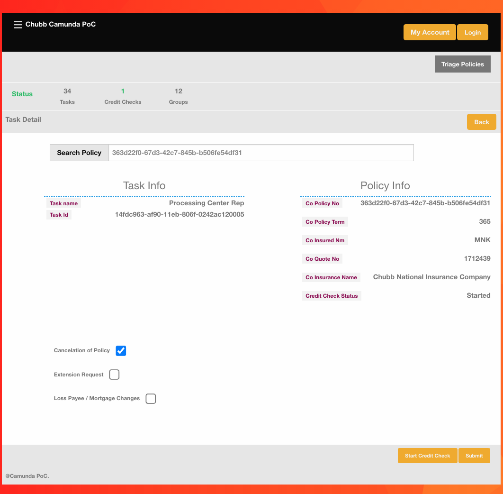
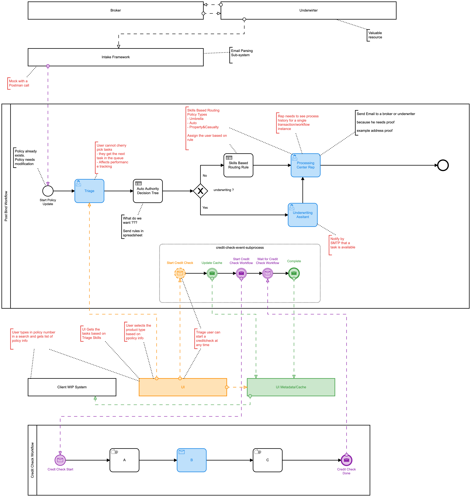
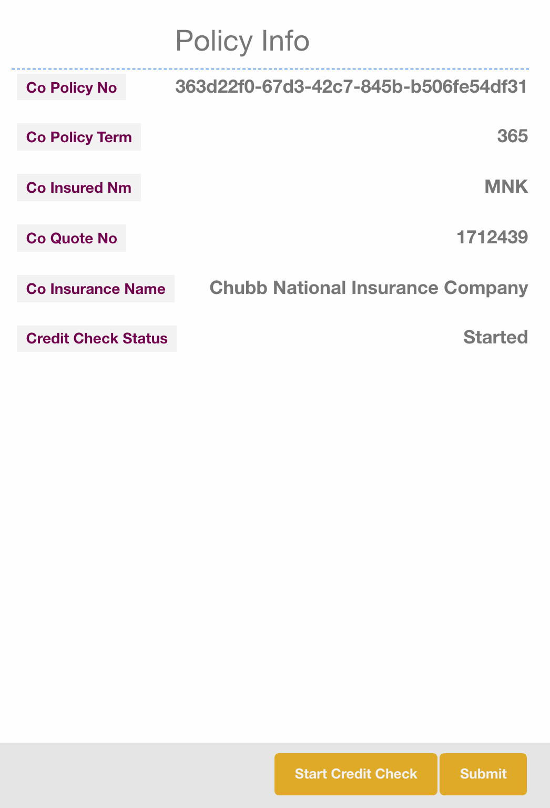
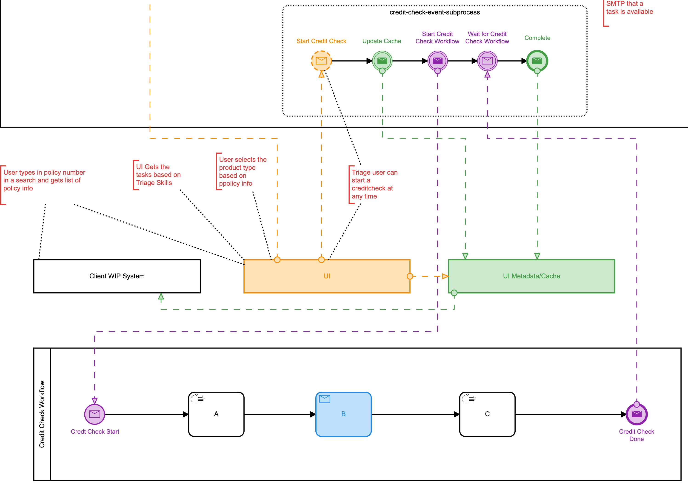

## Use Case

#### Summary
Post Buying Process use-case is demonstrating updating a insurance policy based on certain events that can trigger a policy update.

The Web Based UI demonstrates the Triage of a Policy Update allowing the Triage role to see tasks based on skills and entitlement.

A single Triage task combined with an Event Sub-process is used to simulate a case management pattern with BPMN.

Additionally, DMN based business rules are utilized to route tasks to the correct business unit and assign the correct user roles to tasks.

History data should be sent to Kafka to potentially store in a BI solution.

#### [[use-case-workflow]]Workflow
Underwriters and Brokers interact to potentially trigger a policy update. This is normally done through email interactions. When a policy update is needed an underwirter will send an email to a shared email box. The Intake Framework with parse and determine the intent of the email then start a policy update workflow (post-bind-workflow) when appropriate.

NOTE: The intake framework is simulate by a Postman call to start the workflow. See the `postman` directory for the request to start the workflow.

The triage task is then activated. This enables a triage user to view the task in the Custom UI and prepare the task for Underwriting and Processing. Additionally, a case management feature can be used by the triage user potentially starting a credit-check.

//

Once the triage user submits the task business rules are used to assign and route the tasks to the correct business unit and users.

---

### [[interesting-point-workflow]]Case management with Custom UI and BPMN
====
This section of the process illustrates case management with BPMN. The Triage user is able to start a credit check from the UI. The use clicks the `Start Credit Check` button which triggers the Credit Check SubProcess.
====

====
The Credit Check sub-process is broken into two phases. An Event subprocess is utilized to capture the click from the UI and allows us to monitor the status of the credit check from the parent process. Additionally, using the Event sub-process doesn't interfere with execution of the parent process. In other words the Triage user could also submit the task and continue the normal flow of the process while the credit check continues.

A separate BPMN workflow is also utilized for the Credit Check. It does the actual work of orchestrating the credit check. This allows for reuse of the credit check workflow and concise separation of concerns.
====

### [[use-case-integrations-summary]]Integrations Summary
====
The integrations with the UI are REST based. Starting, retrieving, completing tasks and workflows are done through the Camunda REST API.

Technical integrations like email integration is done through Camunda delegates and listeners. When a user task is started an email is sent to the user.

Additionally, Kafka integration is done through spring-eventing-bridge and spring-clould-streams framework for the purpose of sending Camunda event information to other systems i.e. BI reporting solutions. See <<patterns-for-integration, Patterns for Integration>> and <<kafka-integartion, Kafka Integration>>

More on all these topics in later sections. Jump to section <<ui-integration, UI Integration>> <<spring-eventing-bridge, Spring Eventing Bridge>>
====
